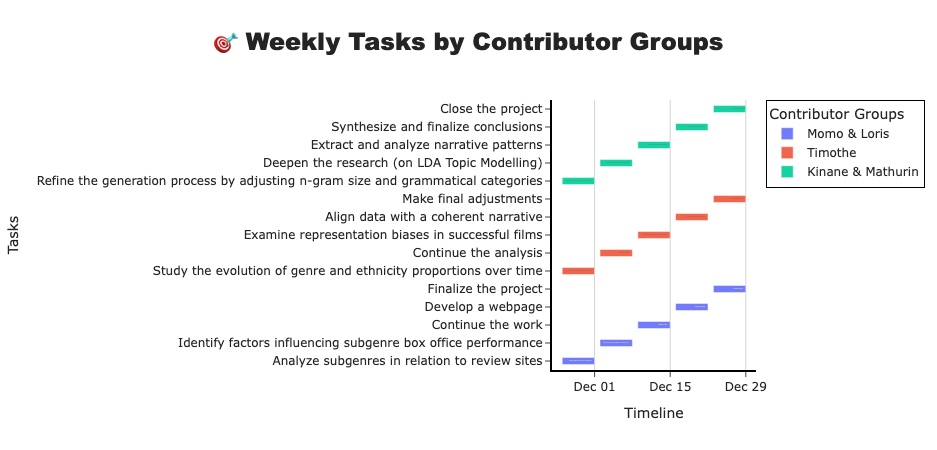

# The Cold War of Laughter: Western Humor vs. Eastern Wit 😂🌍🧊

## Abstract
This project takes a dive into the comedic rivalry between American and European films, uncovering the cultural quirks that make each side laugh. Using data from the CMU Movie Summary Corpus and OMDB, we analyze recurring themes, linguistic styles, and narrative structures to decode the essence of humor on both sides of the Atlantic. Do Americans favor slapstick and sarcasm, while Europeans lean toward dry wit and intellectual wordplay? Are certain jokes universal, or do some fall flat across cultural divides? We also explore representation dynamics—examining how gender and ethnicity shape the humor landscape—and investigate box office trends to see if Hollywood's blockbuster comedies outshine Europe's subtler charm. Through text analysis, visualizations, and linguistic modeling, this project aims to answer whether humor truly transcends borders or remains firmly rooted in cultural context. Laugh, learn, and decide which side of the Atlantic rules the comedy game!

## Research Questions

### 1. Commercial and Critical Success
- What factors—such as themes, casting, runtime, and distribution—drive the success of comedies in these regions?
- Is there a correlation between commercial success (box office) and critical or audience recognition (ratings), and does this vary by continent or audience type?
- Are European comedies rated more favorably than American ones, and do they receive similar evaluations from critics and audiences across different subgenres?

### 2. Narrative and Thematic Analysis
- What recurring themes and narrative patterns define comedies from America and Europe?
- How do cultural differences shape the humor and storytelling styles of these films?
- In what ways do American and European comedies align in their themes, and where do they diverge?

### 3. Gender and Ethnic Representation
- What are the gender and ethnic compositions in American and European comedies?
- How has the representation of these groups evolved over time, and what cultural insights can be drawn from these changes?
- How do leading roles vary by gender and ethnicity across American and European comedies, and how have these trends shifted over the years?

## Supplementary Dataset

1. **The Open Movie Database (OMDB)**:  
   OMDB provided valuable supplementary information, such as box office revenue, runtime, audience ratings, awards, and additional plot summaries. We used this dataset to fill missing values in our original dataset and enrich it with new variables. Merging the datasets was straightforward by aligning on movie titles, with careful handling of movies that share the same name.

2. **Stanford CoreNLP Pipeline**:  
   For missing plot summaries, we ran the Stanford CoreNLP pipeline locally on the remaining movies in our dataset. If a processed output was unavailable, we used the OMDB plot summary as input for the pipeline. This step augmented our dataset significantly, increasing the number of fully processed comedy-related movies from approximately 7,300 to 12,000.

## Methods
### 1. Data Collection and Preparation
   - **Data Wrangling**: Cleaning and organizing data from the CMU Movie Summary Corpus and OMDB to create a structured, unified dataset.
   - **Data Integration**: Merging datasets based on common identifiers to facilitate thematic analysis, character representation analysis, and success metrics.

### 2. Analysis Process
 - Patterns were identified across themes, gender and ethnicity representation, ratings, and commercial success. To highlight these different data structures, various statistical tests were conducted, including:
   - **T-test**: Comparing the means of two groups to detect significant differences; often accompanied by confidence intervals (CIs) to estimate the mean difference.
   - **Kolmogorov-Smirnov (KS)**: Checking if a distribution follows a normal distribution.
   - **Mann-Whitney U**: Comparing ranks between two groups for non-normal distributions.
   - **Spearman**: Measuring the monotonic correlation between two variables, without assuming linearity.

   This variety of comparison tools ensures robust conclusions by accounting for potential initial hypothesis violations. It also provides objective means to assess the presence or absence of significant differences between two groups.
    

 -  For thematic analysis, NLP tools like Stanford CoreNLP to extract recurring narrative themes. For this part, we are going to make a frequency analysis on the plots summaries by leveraging the CoreNLP pipeline results.
    - **Tokenization & stopwords removal** : a common method when manipulating text data is to extract tokens and remove words that are not useful for our analysis.
    - **N-gram generation** : n-grams are a way of parsing sentences by group of n words. For example, we can look at the 2-grams of the form “<verb> <any other word>” to extract recurrent topics in the scenarios.
    - **Frequency analysis** : using the wordclouds visualization, we will extract the dominant topics and features of comedy movies across continents

 - For gender analysis, the following choices were made about :
    - **Representation Metrics**: Quantifying gender and ethnic diversity in lead roles and examining trends over time.
    - **Success Evaluation**: Measuring success in terms of revenue, critical reception, runtime, and audience rating.

### 3. Present the results

Finally, we aim at showing our findings as a webpage datastory, following the guidelines of the course.

## Proposed timeline and Organization within the team

The following figure presents the provisionned timeline :

## Questions for TA's

Given our preliminary exploration of Latent Dirichlet Allocation (LDA) for uncovering thematic structures, do you think it is worthwhile to invest more time refining the LDA process (e.g., optimizing preprocessing, tuning parameters, or increasing topic granularity)? Or would you recommend focusing on alternative methods to achieve deeper insights into narrative trends?

## References

 - [Applied Data Analysis course webpage](https://epfl-ada.github.io/teaching/fall2024/cs401/), EPFL.
 - Manning, Christopher D., Mihai Surdeanu, John Bauer, Jenny Finkel, Steven J. Bethard, and David McClosky. 2014. The Stanford CoreNLP Natural Language Processing Toolkit In Proceedings of the 52nd Annual Meeting of the Association for Computational Linguistics: System Demonstrations, pp. 55-60. [Accessible here](https://stanfordnlp.github.io/CoreNLP/)
 - [Freebase Data Dumps](https://developers.google.com/freebase/data). Google. Accessed on 15/11/2024.

## Acknowledgements

ChatGPT has been used to rephrase and translate to english some parts of this document as well as some comments in the code.
